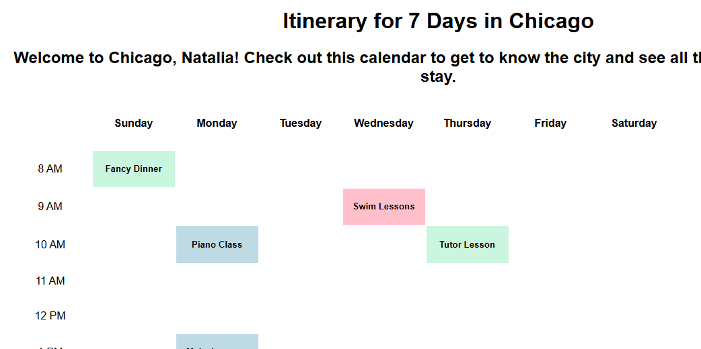

# Amir Farrukh
# Z23441934

# React + Vite Calendar App
A simple app which displays a component-based calendar consisting of a grid of timeslots.

# WALKTHROUGH

# KEY TAKEAWAYS
From this project I learned the basics of using the Vite build tool to rapidly construct webapps build on the React frontend framework. I explored how to create reusable, modular components and use them within each other to create a responsive, organized webpage. A key concept in this exercise was the use of props to set attributes for components. Using props I was able to assign different styling rules to different instances of a component (the events).